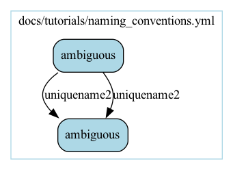

# Naming Conventions

By default, edge inference uses types and file formats only. This is often sufficient, but there can be ambiguous cases where more information is required for inference to give the desired result. Consider the following ambiguous workflow step, and workflow:

cwl_adapters/ambiguous.cwl

```yaml
cwlVersion: v1.0

class: CommandLineTool

requirements:
  InlineJavascriptRequirement: {}

baseCommand: "true"

# This CommandLineTool is solely to demonstrate the --inference_use_naming_conventions feature.
# Each output simply returns the corresponding input.
# Since both outputs are of type string, inference (by default) cannot
# distinguish between the two outputs, and will always choose uniquename2
# since the outputs are considered ordered and matched from bottom to top.

inputs:
  uniquename1:
    type: string
    format: "someformat"

  uniquename2:
    type: string
    format: "someformat"

outputs:
  uniquename1:
    type: string
    # outputs of type: string cannot have formats
    outputBinding:
      outputEval: $(inputs.uniquename1)

  uniquename2:
    type: string
    # outputs of type: string cannot have formats
    outputBinding:
      outputEval: $(inputs.uniquename2)
```

<table>
<tr>
<td>
docs/tutorials/naming_conventions.wic

```yaml
steps:
- ambiguous:
    in:
      uniquename1: string1
      uniquename2: string2
- ambiguous:
```
</td>
<td>
docs/tutorials/naming_conventions.wic_no_flag.png



</td>
</tr>
</table>

As mentioned above, since there is an ambiguity in the output types (both are type: string), inference has "incorrectly" connected the output uniquename2 to the input uniquename1 between steps 1 and 2. One solution is to use explicit edges.

<table>
<tr>
<td>
docs/tutorials/naming_conventions_explicit.wic

```yaml
steps:
- ambiguous:
    in:
      uniquename1: string1
      uniquename2: string2
    out:
    - uniquename1: !& edge1
    - uniquename2: !& edge2
- ambiguous:
    in:
      uniquename1: !* edge1
      uniquename2: !* edge2
```
</td>
<td>
docs/tutorials/naming_conventions_explicit.wic.gv.png


</td>
</tr>
</table>

We can see that the input uniquename1 in step 2 is now "correctly" connected to the output uniquename1 in step 1. Another solution is to simply use the `--inference_use_naming_conventions` flag with the original workflow:

<table>
<tr>
<td>
docs/tutorials/naming_conventions.wic

```yaml
steps:
- ambiguous:
    in:
      uniquename1: string1
      uniquename2: string2
- ambiguous:
```
</td>
<td>
docs/tutorials/naming_conventions.wic_with_flag.png


</td>
</tr>
</table>

Again we see that the input uniquename1 in step 2 is now "correctly" connected to the output uniquename1 in step 1.

While we can always use explicit edges, naming conventions can be used to eliminate duplication. This is particularly useful when the first step in a workflow reads some global configuration data which then needs to be passed to subsequent steps in the workflow. With `--inference_use_naming_conventions`, this does not have to be done expllicitly.